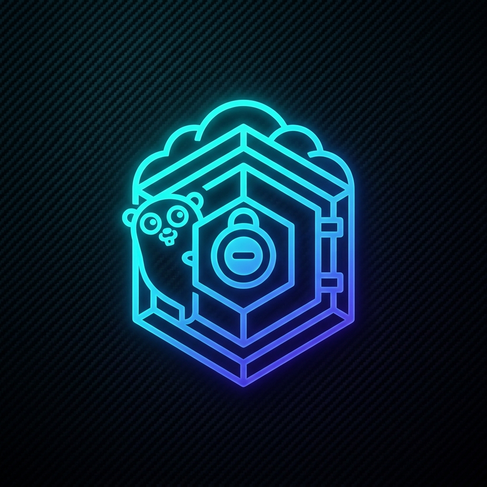

<h1 align="center">
  <br>
  <a href="https://github.com/aquib4040/filestore"></a>
  <br>
  ──「 ғɪʟᴇ sᴛᴏʀᴇ - ɢᴏ ᴇᴅɪᴛɪᴏɴ 」──
</h1>

<p align="center">
  <b>A high-performance, multi-tenant Telegram FileStore Bot written in pure Go.</b><br>
  Features multi-bot cloning, AES-256-GCM token encryption, fail-safe stateless link encoding, FSub join request enforcement, and dynamic keep-awake self-pinging.
</p>

<p align="center">
<a href="https://github.com/aquib4040/filestore/stargazers"></a>
<a href="https://github.com/aquib4040/filestore/network/members"></a>
<a href="https://github.com/aquib4040/filestore/blob/main/LICENSE"></a>
<a href="https://go.dev/"></a>
<a href="https://t.me/canon_bots"></a>
</p>

---

## ⚡ Why Go is Better than Python for Telegram Bots

| Metric | Python (Pyrogram/Telethon) | Go (gotd/td) |
| :--- | :--- | :--- |
| **Idle Memory Usage** | ~120MB - 180MB RAM | **~5MB - 10MB RAM** 🟢 |
| **Concurrency Model** | OS Threads / AsyncIO overhead | **Goroutines (2KB stack each)** 🟢 |
| **Execution Speed** | Interpreted (Slow) | **Compiled Native Binary (Fast)** 🟢 |
| **Docker Image Size** | 250MB - 400MB+ | **~25MB (Multi-stage Alpine)** 🟢 |
| **Multi-Tenant Limit** | ~4-6 bots on a $4/mo VPS | **50 - 100+ bots on a $4/mo VPS** 🟢 |

---

## 🚀 One-Click Cloud Deploys

Deploy your high-performance FileStore bot instantly to cloud platforms:

[](https://render.com/deploy?repo=https://github.com/aquib4040/filestore)
[](https://www.heroku.com/deploy/?template=https://github.com/aquib4040/filestore)
[](https://app.koyeb.com/deploy?repository=github.com/aquib4040/filestore&branch=main&name=go-filestore)
[](https://zeabur.com)

*(For Zeabur, create a project and link your GitHub repository: `https://github.com/aquib4040/filestore`)*

---

## 📂 Detailed File & Directory Structure

```directory
filestore/
├── assets/
│   └── logo.png                # Project logo asset
├── cmd/
│   └── bot/
│       └── main.go             # Application entrypoint (initializes DB, HTTP server & bot engine)
├── pkg/
│   ├── config/
│   │   └── config.go           # Environment variables loader & configuration struct
│   ├── crypto/
│   │   └── crypto.go           # AES-256-GCM symmetric encryption & decryption utilities
│   ├── db/
│   │   └── mongo.go            # MongoDB client & collection handlers (Users, Pros, Clones, FSub, DB Channels)
│   ├── shortener/
│   │   └── client.go           # Shortener API client (Linkshortify, etc.)
│   └── telegram/
│       ├── bot.go              # Central BotManager registry, session management & clone lifecycle
│       ├── dispatcher.go       # Telegram MTProto update dispatchers (Messages, Callbacks, Join Requests)
│       ├── handlers_main.go    # Main bot command handlers, file delivery & settings panels
│       ├── handlers_clone.go   # Clone bot command handlers, isolated clone user bases & settings
│       ├── markup.go           # Inline button keyboard builders & small-caps typography helpers
│       └── state.go            # Thread-safe state registry for interactive user step prompts
├── .env.example                # Template for environment configuration
├── .gitignore                  # Git ignore rules for sessions, secrets, logs & binaries
├── Dockerfile                  # Multi-stage Docker build manifest (Golang builder -> Alpine runner)
├── docker-compose.yml          # Container orchestration manifest (Bot + MongoDB service)
├── app.json                    # Heroku container deployment manifest
├── render.yaml                 # Render PaaS deployment blueprint
├── koyeb.yaml                  # Koyeb PaaS deployment blueprint
├── zeabur.yml                  # Zeabur deployment configuration
├── Procfile                    # Process file for Heroku/PaaS runners
├── runtime.txt                 # Go runtime version lock file
├── key_generator.html          # Browser utility to generate secure 256-bit encryption keys
└── README.md                   # Project documentation & user guide
```

---

## 🌟 Key Features

*   **👥 Multi-Bot Cloning**: Users can spawn their own personal clone bot instances using the `/clone` command with an interactive 3-step setup (Bot Token → MongoDB URI → DB Storage Channel with live admin verification).
*   **🛡️ Fail-Safe Base64 Link Payload**: Download links embed `channel_id` and `message_id`(s) directly inside the Base64 payload (`get_<channelID>_<msgID>`). If MongoDB is offline, wiped, or banned, links continue working 100% statelessly directly from Telegram!
*   **🔒 AES-256-GCM Token Encryption**: Clone bot tokens are encrypted in MongoDB using military-grade **AES-256-GCM** authenticated encryption. Generate keys online at [aquib4040.github.io/filestore/key_generator.html](https://aquib4040.github.io/filestore/key_generator.html).
*   **📡 Force Subscription (FSub) & Join Request Approval**: Restricts file access until users join configured FSub channels. Automatically approves monitored channel join requests.
*   **📨 Live Progress Broadcasts**: Background copy-broadcasting to all users with real-time status reporting, interactive progress bars (`[████░░░░░░] 40%`), and flood-wait retry handling.
*   **⏱️ Downloader Preferences (`/mysettings`)**: Per-user customizable auto-delete timers (1m, 5m, 15m, 30m) and forward protection toggles.
*   **🔋 Keep-Awake Worker (HTTP Self-Ping)**: Pings the health server every 3 minutes using the `FQDN` environment variable, preventing free-tier cloud containers (Render, Zeabur) from sleeping.

---

## 🕹️ Command Reference

### Main Bot Commands

| Command | Scope | Description |
| :--- | :--- | :--- |
| `/start` | Public | Greets user or retrieves shared file(s) |
| `/mysettings` | Public | Opens personal downloader preferences panel |
| `/settings` | Admin | Opens main admin control panel (FSub, DB Channels, Shortener, Auto-Del) |
| `/stats` | Admin | Displays system metrics (Users, Clones, Premium, Uptime, Go version) |
| `/users` | Admin | Displays total user count |
| `/genlink` | Admin | Generates a single file download link |
| `/batch` | Admin | Generates a range batch file download link |
| `/broadcast` | Admin | Broadcasts text or replied message to all users |
| `/ban <id>` | Admin | Bans a user by ID |
| `/unban <id>` | Admin | Unbans a user by ID |
| `/addpremium <id> [days]` | Admin | Grants premium status (optional duration in days) |
| `/delpremium <id>` | Admin | Revokes premium status |
| `/premiumusers` | Admin | Lists all active premium users with expiry dates |
| `/profile <id>` | Admin | Displays detailed user profile |
| `/clone` | Admin/Public | Spawns a personal clone bot instance (3-step setup) |
| `/deletecloned` | Admin/Public | Deletes a personal clone bot instance |

### Cloned Bot Commands

| Command | Scope | Description |
| :--- | :--- | :--- |
| `/start` | Public | Greets user or retrieves shared file(s) |
| `/mysettings` | Public | Personal downloader preferences |
| `/premium` | Public | Displays pricing details and UPI payment ID |
| `/settings` | Clone Owner | Opens clone settings panel (Shortener, custom caption, UPI, Plans, FSub/DB Channels) |
| `/users` | Clone Owner | Displays total users of this clone bot |
| `/broadcast` | Clone Owner | Broadcasts message exclusively to this clone bot's users |
| `/ban <id>` | Clone Owner | Bans user specifically from this clone bot |
| `/unban <id>` | Clone Owner | Unbans user from this clone bot |
| `/addpremium <id> [days]` | Clone Owner | Grants clone-scoped premium status |
| `/delpremium <id>` | Clone Owner | Revokes clone-scoped premium status |
| `/premiumusers` | Clone Owner | Lists premium users for this clone bot |
| `/profile <id>` | Clone Owner | Displays user profile for this clone bot |

---

## ⚙️ Configuration Variables

Create a `.env` file in the root directory:

```env
# --- TELEGRAM API CONFIGURATION ---
API_ID=1234567               # Get from https://my.telegram.org
API_HASH="your_api_hash"     # Get from https://my.telegram.org
BOT_TOKEN="your_bot_token"   # Get from @BotFather

# --- MONGO DATABASE CONFIGURATION ---
MONGO_URI="mongodb+srv://..."# MongoDB Atlas connection string
DB_NAME="filestore"

# --- OWNER & ADMIN CONFIGURATION ---
OWNER_ID=123456789           # Numeric Telegram User ID of primary owner
ADMINS="123456,789012"       # Optional extra admin User IDs (comma-separated)

# --- OPTIONAL CONFIGURATIONS ---
PORT=8080                    # Port for HTTP health checks
AUTO_DEL=300                 # Delay (seconds) to auto-delete shared files (0 to disable)
DISABLE_BTN=true             # Block sharing buttons on media forwards
PROTECT=true                 # Block forwarding/saving files from the bot
CLONE_LIMIT=3                # Maximum cloned bots allowed per User ID
CLONE_ALLOW=true             # Enable/disable cloning feature (true/false)

# --- SECURITY (ENCRYPTION) ---
TOKEN_ENCRYPTION_KEY=""      # 32-char key to encrypt bot tokens in DB (Generate key: https://aquib4040.github.io/filestore/key_generator.html)

# --- KEEP-AWAKE WORKER ---
FQDN="mybot.render.com"      # App domain to activate 3-minute self-ping worker
```

---

## 🖥️ VPS & Docker Deployment

### Method 1: Docker-Compose (Recommended)

```bash
git clone https://github.com/aquib4040/filestore.git
cd filestore
cp .env.example .env
nano .env
docker-compose up --build -d
```

### Method 2: Native Binary (Go 1.21+)

```bash
go mod download
go build -o filestore-bot ./cmd/bot
./filestore-bot
```

---

## 📢 Community & Support

- **Telegram Channel**: [@canon_bots](https://t.me/canon_bots)
- **Source Code**: [github.com/aquib4040/filestore](https://github.com/aquib4040/filestore)
